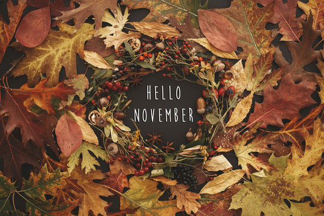

========
NOVEMBER
========

November comes

And November goes,

With the last red berries

And the first white snows.

With *night* coming early,

And dawn coming late,

And ice in the bucket

And frost by the gate.

The fires burn

And the kettles sing,

And earth sinks to rest

Until next spring.

Note
----
.. note::
Elizabeth Coatsworth

Image
-----

